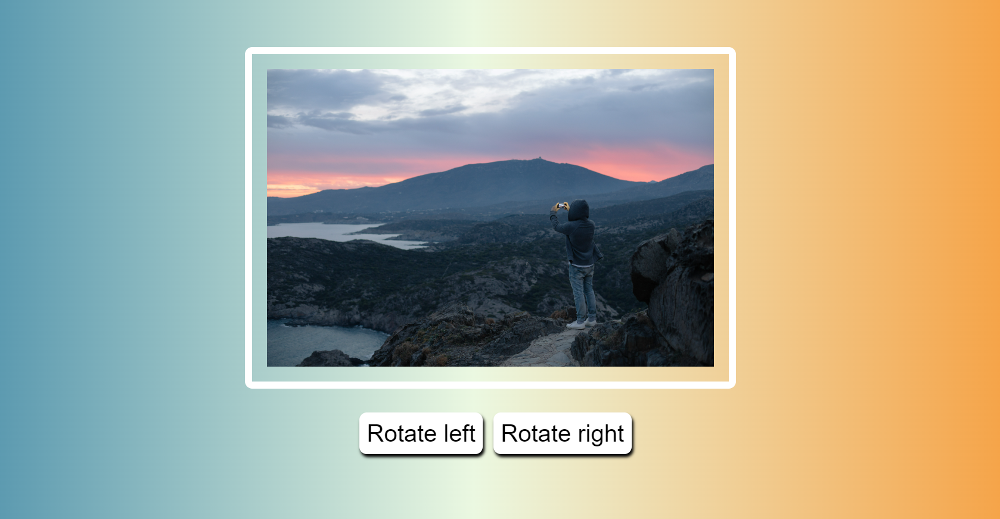

# Image Rotate

**Description:**

Image Rotate is a simple web application that allows you to rotate an image left or right by 90 degrees with the click of a button. It's a beginner-friendly project created using HTML, CSS, and JavaScript. The project provides a fun and interactive way to learn about basic DOM manipulation and CSS styling.

**Features:**

- Rotate an image left or right by 90 degrees.
- Smooth transition animation for image rotation.
- Responsive design for seamless viewing on different devices.

**Screenshot:**

**How to Use:**

1. Clone or download the project repository.
2. Open the `index.html` file in a web browser.
3. Click the "Rotate left" button to rotate the image counter-clockwise by 90 degrees.
4. Click the "Rotate right" button to rotate the image clockwise by 90 degrees.
